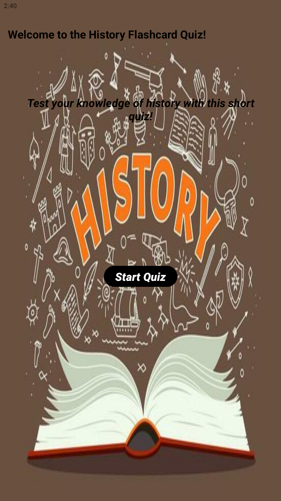

# IMAD5112-Assignment-2- By Nikyle-Mazeau

## A fully functional Android Kotlin studio project written to help you improve your knowledge of human history!

This project is a flashcard learning project that was built along with a youtube tutorial (linked down below) that helps improve your knowledge of human history and provides for a fun challenge that you can take on and see how many you can get right!! Every part of this project was made to achieve the following:

* Helps you improve your knowledge of human history if you're not already good at it
* A fun flashcard game you can play with your friends or if you are an educator, can be used for a fun challenge with the kids
* It was created with an engaging User Interface to allow for smooth running to be easy on the eye
* If you are on the younger side, it can also be used as a study tool for any history exams or tests coming up as it has challenging and engaging questions

## Watch the youtube tutorial!

## Language and Usage

This project was created using Android Kotlin studio language to create a simple true and false flashcard answering project

To use the project, do the following:

* Open the code onto your bluestacks emulator
* A very simple User interface, One button on the opening page to be clicked
* You will then be taken to the main flashcard screen
* Read the question provided in White text
* Click either true or false based on what answer you think is correct
* The project will provide you with feedback whether your answer was correct or not, your score will be taken into account
* Once you have reached the final question, click the "Your Score" button
* This will take you to the final page of the project
* Provide you with personalised feedback based on how you performed and give you your final score
* Once you are done click the "Exit" button and your app will be closed

## Screenshots/Images of the app running

Below are some screenshots of the app running on the emulator if you are still confused or unsure

